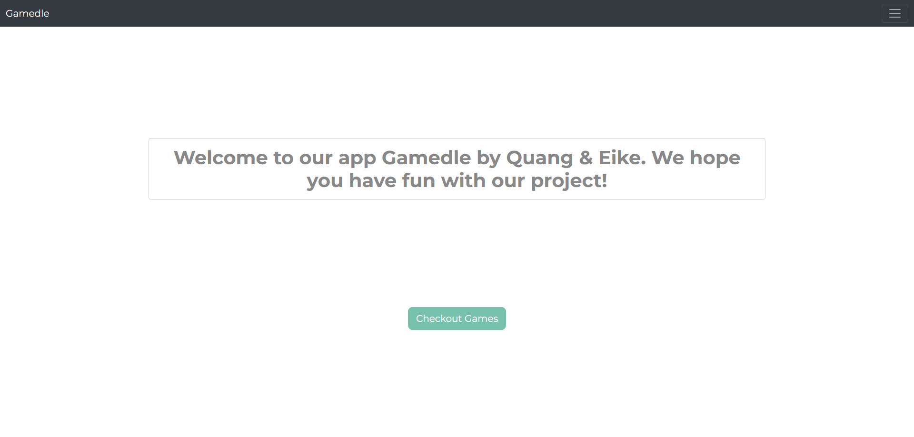
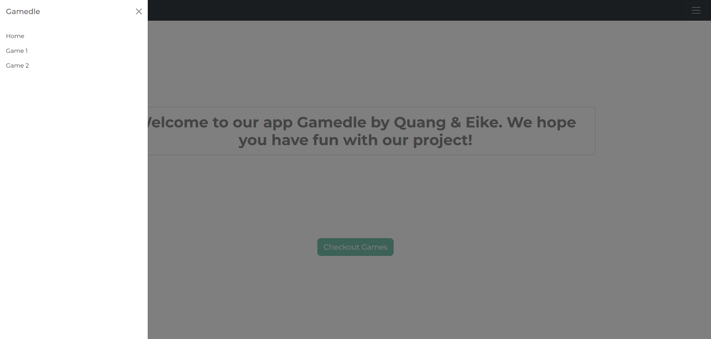
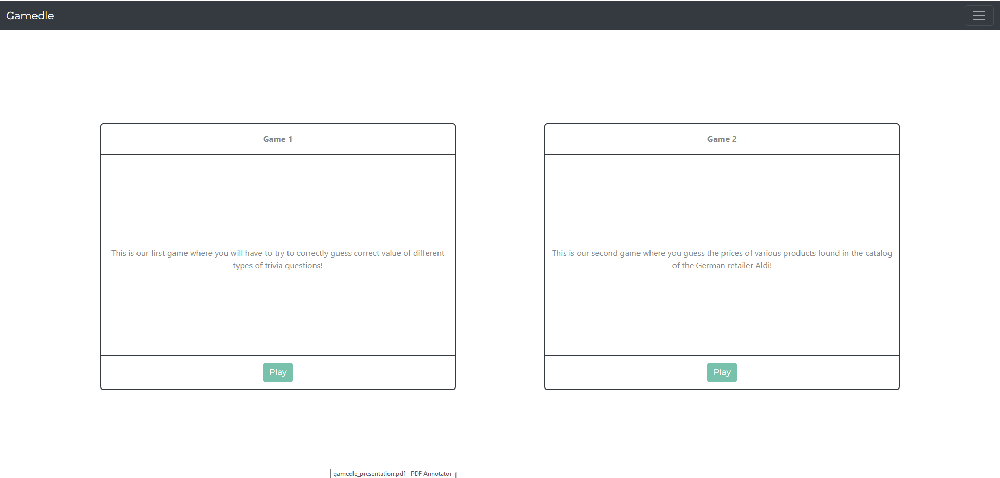
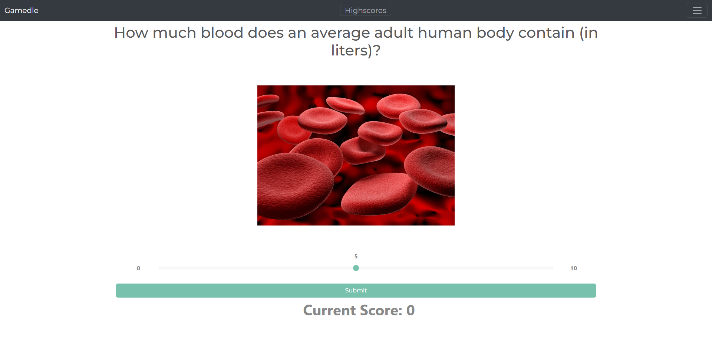
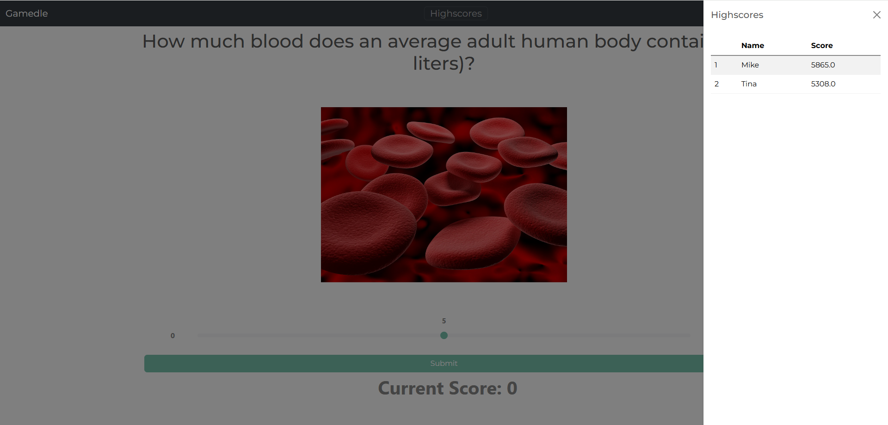
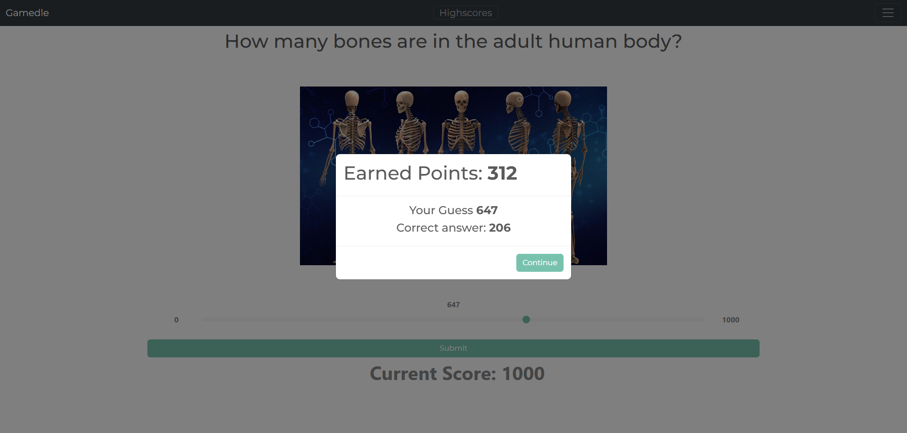
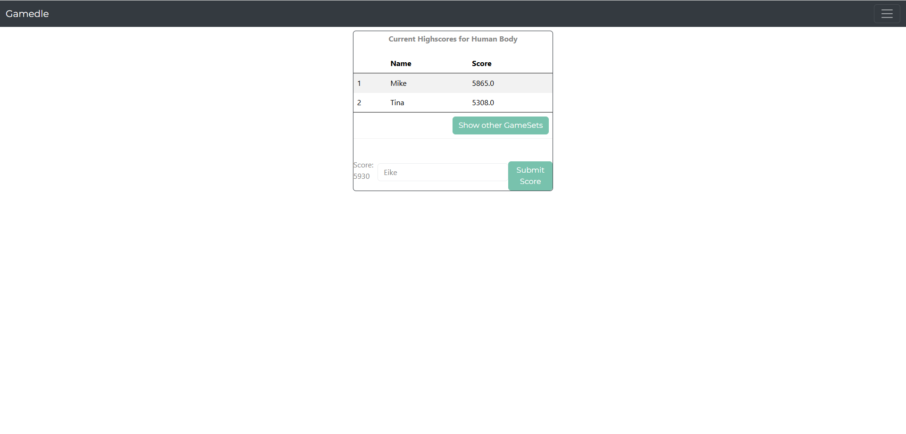
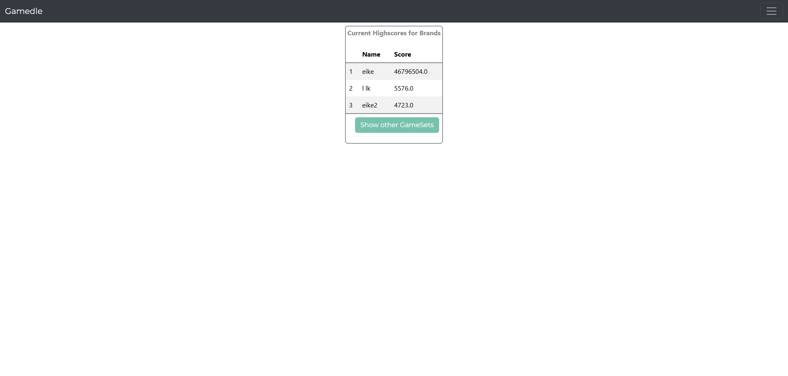

{: .label }
[Eike]

## User Experience

# Landing page

On our Landing page, next to a small welcome message you can find the navigation bar which is used to navigate through our app. You can see it 100% of the time on each screen in slightly different versions.

# Game Selection
Here you can select our available games. Our Second game which took inspiration from costcodle has not been implemented yet.

# Game Sets
Here you can select the available Game Sets of our guessing game!

# Active Game
After selecting a Game set, simply follow the instruction on the screen. Additionally you can checkout the available highscores for the current Game Set by clicking the button in the middle of the navbar.

Our app also shows how many points you have achieved each round and what the current answers was. 

# Highscores
After finishing the Game Set enter your name to see the updated highscore list featuring your score.

