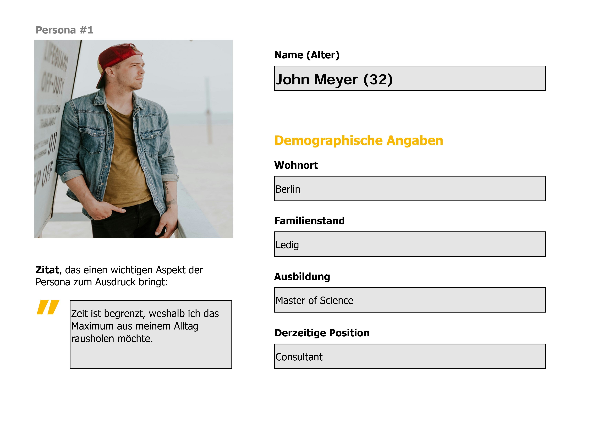
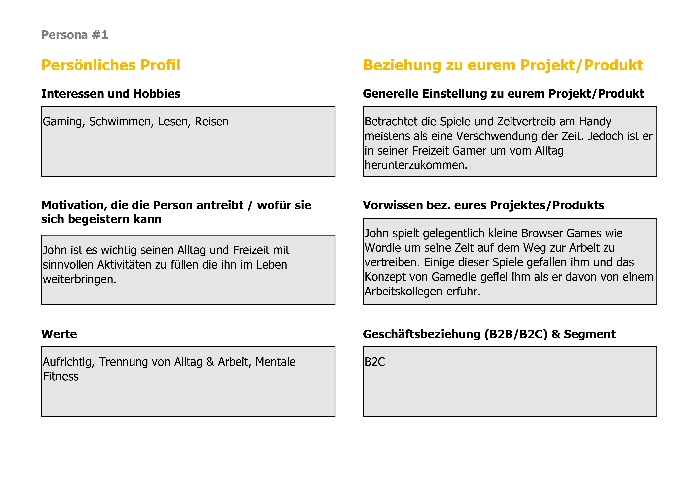
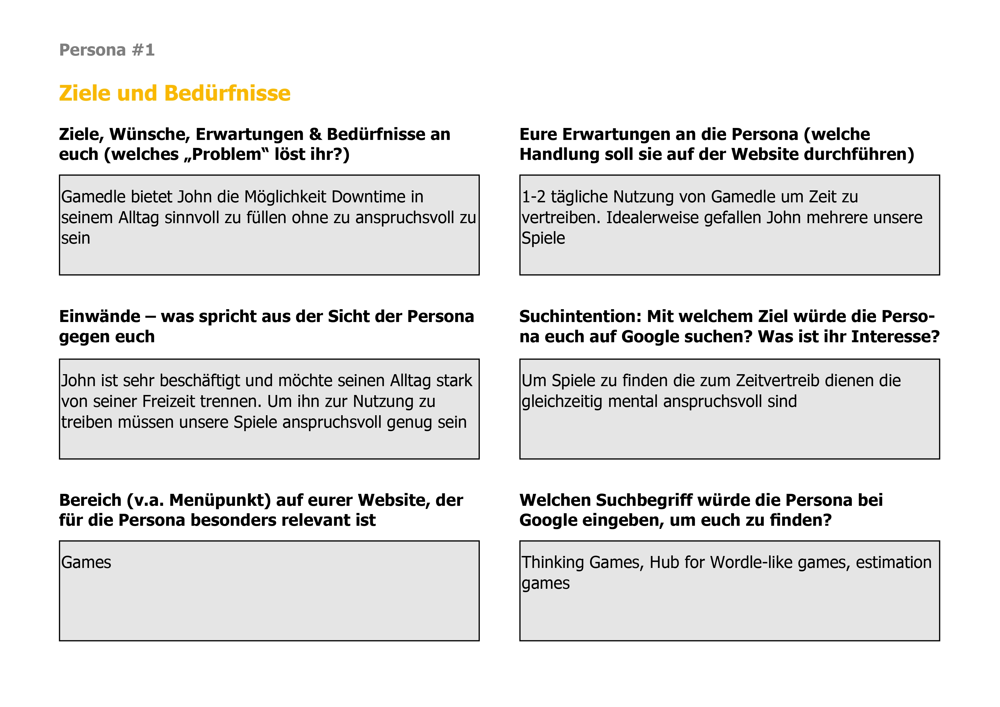
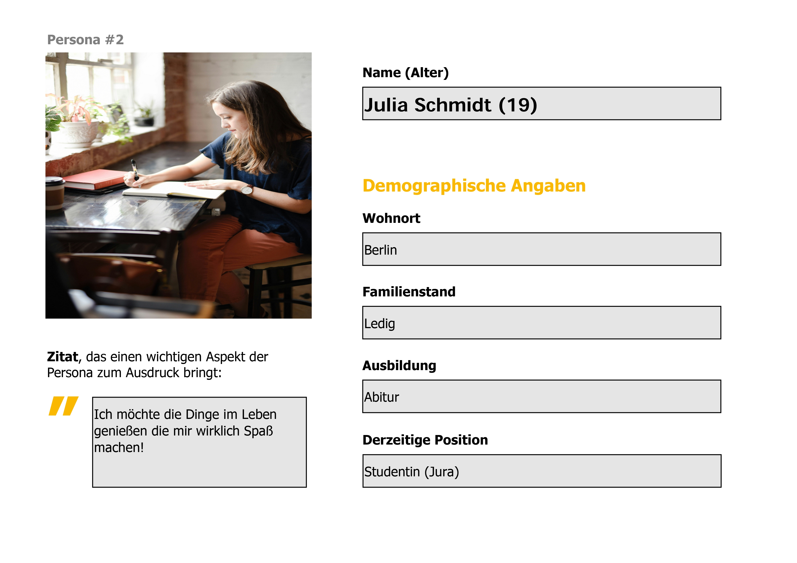
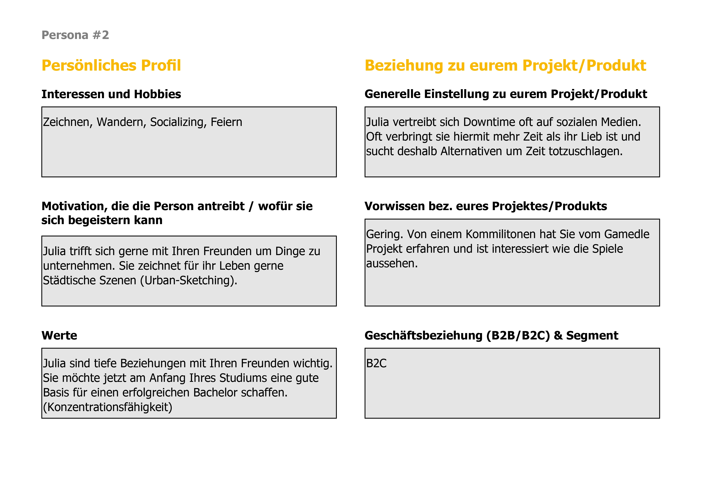
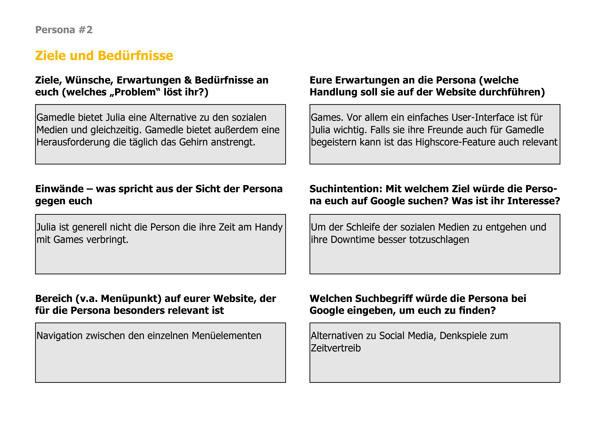

{: .label }
Eike Gebing

{: .no_toc }
# Value proposition

{: .text-delta }

Table of contents

+ ToC
{: toc }

## The problem

Currently there is a vast sea of distractions that can be more or less valuable and mentally engaging for modern internet users. 

In this ocean of possibilities of options to pass a couple of minutes in their daily routine, it is challenging for most people to identify the choices that combine ease of access and engaging content, which does not make the user feel like they have wasted their time on "just another stupid game".

Often these games are expertly designed to capture our attention, but leave us feeling like we are not actively straining our mental capacities. Rather they feel like they suppress our thoughts and worsen our ability to concentrate.

Most solutions to this problems also require an unwanted sign-up process that first has to be completed for the user to get a full experience. This is most often the case when the user wants to compare his/her statistics in the application to that of other users such as friends or colleagues.

## Our solution

Gamedle offers people that are looking for a quick but engaging challenge a hub for a number of games (TBD) that combine accessibility, variety and difficulty. 

We offer the user a platform where he can compare himself conveniently with desired competitors without the need of a direct sign-up to our side.

{: .text-delta }

List of our current games

- Game 1 (https://www.chronophoto.app/game.html)  
  Our first web game would be similar to "chronophoto", offering different GameSets, so we can follow a data model for multiple games. GameSets could be finding pictures like in chronophoto, guessing the prices of depicted apartments or artworks and further ideas we find
- Game 2 (https://costcodle.com/)  
  Our second game would be a version of costcodle working with similar GameSets to our first game but with a slightly altered UI. Also we would like to gather sample data from German retailers to differentiate us from the costcodle game

  Depending on how far we come we might decide to add or remove from these current plans.

## Target user

The scope for our target users is quite broad. In general any person looking to kill some time in their daily routine is a possible user of Gamedle. Still we have designed some personas to more accurately describe some possible users.

Persona 1

---

---

Persona 2

---

---

## Customer journey

In order to better illustrate how we envision our app to be navigated we created wireframes that depict the core features of gamedle.

Home Screen wireframes

---

Slide Game UI wireframes

---

